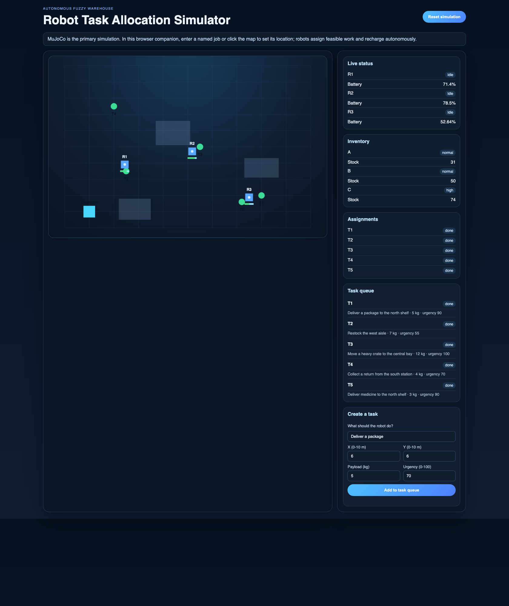
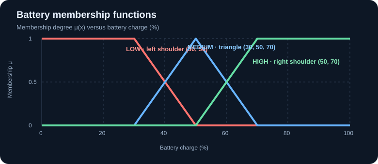

# Fuzzy Robot Coordinator: Interactive Math & Simulation Guide

> **Math rendering:** equations use standard `$...$` and `$$...$$` Markdown math delimiters. GitHub renders them directly. In VS Code, use a Markdown preview with math support if your current preview displays the TeX source instead.

This guide connects the equations to the implementation and MuJoCo demo. It is designed for reading in small steps: use the clickable contents, expand the worked examples, and tick off the experiments as you try them.

## Contents

- [Watch the MuJoCo simulation](#watch-the-mujoco-simulation)
- [Add a task in the web dashboard](#add-a-task-in-the-web-dashboard)
- [MuJoCo vs. the web dashboard](#mujoco-vs-the-web-dashboard)
- [1. Inputs and feasibility](#1-inputs-and-feasibility)
- [2. Membership functions](#2-membership-functions)
- [3. Fuzzy inference](#3-fuzzy-inference-sugeno)
- [4. Mathematical baseline](#4-mathematical-baseline)
- [5. Assignment optimization](#5-assignment-optimization)
- [6. Robot motion in MuJoCo](#6-robot-motion-in-mujoco)
- [7. Battery and charging](#7-battery-and-charging)
- [8. Try it yourself](#8-try-it-yourself)
- [Implementation map](#implementation-map)

## Watch the MuJoCo simulation

This is an animation rendered from the project's MuJoCo model and physics, not a mock-up:


[Open the still screenshot](./docs/assets/mujoco-warehouse-demo.png) ·
[Regenerate the GIF](#regenerate-the-mujoco-animation)

The cyan pad is the charging station; gold and green markers are open and completed jobs. The viewer also shows live robot/task labels.

## Add a task in the web dashboard

The browser dashboard is an optional, local companion for entering jobs and watching the simplified warehouse view. Start it from the repository root:

```bash
.venv/bin/python simulator.py
```

Open [http://localhost:8000](http://localhost:8000). The screenshot shows the map, robot status, task queue, and complete task-entry form:



To submit a task:

1. Click a location on the warehouse map to fill in **X** and **Y**, or type the coordinates directly. Both coordinates are in metres and must be between 0 and 10.
2. Enter a short task description, such as `Deliver medicine to the north shelf`.
3. Enter the payload in kilograms. It must be positive and must fit at least one robot's capacity to be assignable.
4. Set urgency from 0 to 100.
5. Select **Add to task queue**. The page confirms the new task ID and updates the task queue and robot assignments. The robots select feasible work automatically.

Use **Reset simulation** to restore the starter scenario. The browser server is intended for local development and has no authentication; do not expose it directly to the public internet.

## MuJoCo vs. the web dashboard

Both views use the project's task-allocation and battery policy, but they serve different purposes:

| | MuJoCo (primary) | Web dashboard (optional companion) |
|---|---|---|
| What it is | A 3D MuJoCo physics simulation | A lightweight 2D canvas visualization and task-entry page |
| Robot movement | Motorized differential-drive bodies move through MuJoCo physics under wheel control | Robots move in the browser prototype's simplified state simulation; this is not MuJoCo physics |
| Best for | Seeing the actual simulated robot model, wheel-driven movement, and charging dock | Quickly creating tasks, choosing map coordinates, and inspecting status in a browser |
| Add a task | Type `task <x> <y> [payload] [urgency] [description...]` in the MuJoCo terminal | Fill out the form, or click the map to set the coordinates, then select **Add to task queue** |
| Launch | `.venv/bin/mjpython mujoco_sim.py` on macOS | `.venv/bin/python simulator.py`, then open `http://localhost:8000` |

The browser view is not a remote MuJoCo renderer and does not replace the 3D simulation. Use MuJoCo when the goal is to experiment with physical robot motion; use the browser when the goal is to enter tasks and inspect the simplified dashboard.

## 1. Inputs and feasibility

For robot $i$ and task $j$, the engine considers battery $B_i$, position $(x_i,y_i)$, workload $W_i$, task payload $q_j$, robot payload capacity $C_i$, task urgency $U_j$, and task position $(x_j,y_j)$.

Euclidean travel distance and normalized payload load are:

$$
D_{ij} = \sqrt{(x_i-x_j)^2 + (y_i-y_j)^2},
\qquad
L_{ij} = \frac{q_j}{C_i}.
$$

A task fits on a robot only when:

$$
L_{ij} \leq 1
\quad\Longleftrightarrow\quad
q_j \leq C_i.
$$

Pairs that violate this condition are marked infeasible (`None`) and cannot be assigned.

<details>
<summary>What these inputs mean in this demo</summary>

Battery is a percentage. Distance and warehouse coordinates use metres. Workload is a small indicator (0–2 in the seeded robots). Payload is measured in kilograms. Urgency ranges from 0 to 100.

For example, a 5 kg task assigned to a robot with 10 kg capacity has $L=5/10=0.5$. A 12 kg task on that same robot has $L=1.2$, so that robot-task pair is infeasible.
</details>

## 2. Membership functions

Fuzzification converts a crisp number into one or more linguistic membership degrees between zero and one. The graph below shows the actual battery memberships used in `fuzzy_robot/main.py`.



### Triangular membership

For $a<b<c$, a triangular set is:

$$
\mu_{\triangle}(x;a,b,c)=
\max\left(0,\min\left(\frac{x-a}{b-a},\frac{c-x}{c-b}\right)\right).
$$

### Shoulder memberships

The left shoulder (high membership at small values) is:

$$
\mu_{\mathrm{left}}(x;a,b)=
\max\left(0,\min\left(1,\frac{b-x}{b-a}\right)\right).
$$

The right shoulder (high membership at large values) is:

$$
\mu_{\mathrm{right}}(x;a,b)=
\max\left(0,\min\left(1,\frac{x-a}{b-a}\right)\right).
$$

The implementation uses these breakpoints:

| Variable | Linguistic set | Membership function |
|---|---|---|
| Battery (%) | low | Left shoulder $(30,50)$ |
| | medium | Triangle $(30,50,70)$ |
| | high | Right shoulder $(50,70)$ |
| Distance (m) | near | Left shoulder $(2,5)$ |
| | medium | Triangle $(3,6,9)$ |
| | far | Right shoulder $(7,11)$ |
| Workload | light | Left shoulder $(0.5,1.5)$ |
| | moderate | Triangle $(0.5,1.5,2.5)$ |
| | heavy | Right shoulder $(1.5,2.5)$ |
| Load ratio | low | Left shoulder $(0.2,0.4)$ |
| | medium | Triangle $(0.3,0.5,0.7)$ |
| | high | Right shoulder $(0.6,0.8)$ |
| Urgency (0–100) | low | Left shoulder $(20,40)$ |
| | medium | Triangle $(25,50,75)$ |
| | high | Triangle $(60,80,95)$ |
| | critical | Right shoulder $(85,100)$ |

Sets overlap intentionally. An input may partially belong to both `medium` and `high`, for example.

<details>
<summary>Worked fuzzification: battery 60%, load ratio 0.5</summary>

Battery memberships:

$$
\mu_{\mathrm{low}}(60)=0,\qquad
\mu_{\mathrm{medium}}(60)=\frac{70-60}{70-50}=0.5,\qquad
\mu_{\mathrm{high}}(60)=\frac{60-50}{70-50}=0.5.
$$

So 60% battery is halfway between the medium and high sets. For load ratio $L=0.5$:

$$
\mu_{\mathrm{low}}(0.5)=0,\qquad
\mu_{\mathrm{medium}}(0.5)=1,\qquad
\mu_{\mathrm{high}}(0.5)=0.
$$

The number is not replaced by a word: the fuzzy system keeps the membership degrees and lets rules combine them.
</details>

## 3. Fuzzy inference (Sugeno)

The current model has eight hand-authored rules. A rule's AND conditions use the minimum operator; this gives its firing strength:

$$
\alpha_r = \min_{(v,\ell)\in r}\mu_{v,\ell}(x_v).
$$

For example, the rule “battery high AND distance near AND load low” fires at:

$$
\alpha_r = \min\left(
\mu_{\mathrm{battery,high}},
\mu_{\mathrm{distance,near}},
\mu_{\mathrm{load,low}}
\right).
$$

The numerical inputs for each Sugeno consequent are normalized as:

$$
b=\frac{B_i}{100},\qquad
d=\min\left(\frac{D_{ij}}{14},1\right),\qquad
\ell=L_{ij},\qquad
w=\min\left(\frac{W_i}{3},1\right),\qquad
u=\frac{U_j}{100}.
$$

Each rule produces a first-order Sugeno output:

$$
z_r=\mathrm{clip}_{[0,1]}
\left(c_r+\beta_{r,b}b+\beta_{r,d}d+
\beta_{r,\ell}\ell+\beta_{r,w}w+\beta_{r,u}u\right).
$$

The eight rule consequents in the code are:

| Rule | Conditions | $c$ | $\beta_b$ | $\beta_d$ | $\beta_\ell$ | $\beta_w$ | $\beta_u$ |
|---:|---|---:|---:|---:|---:|---:|---:|
| 1 | Battery high, distance near, load low | 0.70 | 0.20 | -0.10 | -0.10 | -0.05 | 0.10 |
| 2 | Battery high, distance medium, load medium | 0.60 | 0.20 | -0.10 | -0.10 | -0.05 | 0.10 |
| 3 | Battery medium, distance near, load medium | 0.55 | 0.15 | -0.05 | -0.10 | -0.05 | 0.15 |
| 4 | Battery low, distance far | 0.20 | 0.10 | -0.20 | -0.10 | -0.10 | 0.10 |
| 5 | Load high, battery low | 0.15 | 0.10 | -0.05 | -0.20 | -0.10 | 0.10 |
| 6 | Urgency critical, battery high, distance near | 0.75 | 0.15 | -0.05 | -0.05 | -0.05 | 0.20 |
| 7 | Workload heavy, distance far | 0.20 | 0.10 | -0.15 | -0.05 | -0.20 | 0.10 |
| 8 | Urgency high, battery medium, distance medium | 0.55 | 0.15 | -0.10 | -0.05 | -0.05 | 0.20 |

When at least one rule fires, the fuzzy score is the weighted average of its consequents:

$$
S^{\mathrm{fuzzy}}_{ij}=
\frac{\sum_r \alpha_r z_r}{\sum_r \alpha_r},
\qquad \sum_r \alpha_r>0.
$$

If no rule fires ($\sum_r\alpha_r=0$), the implementation returns a fuzzy score of $0$.

This is Sugeno-style inference: numerical rule consequents are averaged. It is not Mamdani centroid defuzzification. The rules and coefficients are designed by hand; there is no learned training model yet.

## 4. Mathematical baseline

A weighted utility score gives an independent numerical baseline. First make every feature “larger is better”:

$$
\begin{aligned}
b_i &= \frac{B_i}{100},\\
d^+_{ij} &= \max\left(0,1-\frac{D_{ij}}{14}\right),\\
\ell^+_{ij} &= \max(0,1-L_{ij}),\\
w^+_i &= 1-\min\left(\frac{W_i}{3},1\right),\\
u^+_j &= \frac{U_j}{100}.
\end{aligned}
$$

Then compute:

$$
S^{\mathrm{math}}_{ij}
=0.35b_i+0.25d^+_{ij}+0.20u^+_j
+0.15\ell^+_{ij}+0.05w^+_i.
$$

The weights sum to one. The final suitability blends fuzzy and baseline scores:

$$
S_{ij}=0.65S^{\mathrm{fuzzy}}_{ij}+0.35S^{\mathrm{math}}_{ij}.
$$

The fuzzy system is the main contribution (65% of this blended score); the weighted baseline contributes 35%. These weights are transparent design choices, not learned values.

## 5. Assignment optimization

The allocator considers idle, non-charging robots above the low-battery threshold and all pending tasks. Urgency scales each feasible robot-task score:

$$
P_{ij}=S_{ij}\left(0.5+\frac{U_j}{200}\right).
$$

Since $0\leq U_j\leq100$, the multiplier ranges from 0.5 to 1. Let $x_{ij}\in\{0,1\}$ mean robot $i$ receives task $j$. The dispatch solves:

$$
\max_x\sum_i\sum_j P_{ij}x_{ij}
$$

subject to:

$$
\sum_j x_{ij}\leq1\quad\forall i,
\qquad
\sum_i x_{ij}\leq1\quad\forall j,
\qquad
x_{ij}=0\quad\text{for infeasible payload pairs}.
$$

These constraints mean each robot gets at most one new job in a dispatch, each task goes to at most one robot, and over-capacity pairs are forbidden. Robots can remain idle and tasks can wait. Existing in-progress assignments stay reserved.

For the small demo, `simulator.py` searches all possible partial one-to-one matchings and selects the maximum total priority. `fuzzy_robot/main.py` uses the same objective for its static planner. This is exact for the three-robot demo; for a much larger fleet, replace exhaustive search with the Hungarian algorithm or min-cost flow.

<details>
<summary>Worked assignment comparison</summary>

Suppose two robots and two tasks have these already urgency-weighted priorities:

| | Task A | Task B |
|---|---:|---:|
| Robot 1 | 0.90 | 0.80 |
| Robot 2 | 0.85 | 0.10 |

A greedy first choice of Robot 1 → A leaves Robot 2 → B, total $0.90+0.10=1.00$. The global matching instead selects Robot 1 → B and Robot 2 → A, total $0.80+0.85=1.65$. The implementation optimizes the total, not each local choice independently.
</details>

## 6. Robot motion in MuJoCo

The MuJoCo robots have two actuated wheels and use differential-drive kinematics. For wheel radius $r$, wheel separation $L$, and wheel angular speeds $\omega_L,\omega_R$:

$$
v=\frac{r}{2}(\omega_R+\omega_L),
\qquad
\dot{\theta}=\frac{r}{L}(\omega_R-\omega_L).
$$

The controller aims at the assigned task or charging dock. Target bearing, heading error, and distance are:

$$
\theta^\ast=\mathrm{atan2}(y^\ast-y,x^\ast-x),
\qquad
e_\theta=\mathrm{wrap}(\theta^\ast-\theta),
\qquad
d=\sqrt{(x^\ast-x)^2+(y^\ast-y)^2}.
$$

The commanded linear and angular velocities are:

$$
v_c=\min(0.8,1.2d)\max(0,\cos(e_\theta)),
\qquad
\omega_c=\mathrm{clip}(2.5e_\theta,-1.8,1.8).
$$

Convert those commands to wheel speeds:

$$
\omega_L=\frac{v_c-\frac{L}{2}\omega_c}{r},
\qquad
\omega_R=\frac{v_c+\frac{L}{2}\omega_c}{r}.
$$

The wheel speeds are limited to $[-12,12]$ rad/s and sent to MuJoCo velocity actuators. MuJoCo advances the bodies and wheels; measured positions feed back to the task and battery state. This demo follows direct target bearings—it does not yet do obstacle avoidance or global path planning.

## 7. Battery and charging

Battery is a simplified simulation state, not an electrical or motor-current model. The MuJoCo path reduces charge by 1.5 percentage points per metre travelled. At or below 25%, a robot suspends work and targets the cyan dock at $(1,9)$. At the dock it charges at 12 percentage points per simulated second until 85%, then returns to the pending queue.

## 8. Try it yourself

Run the MuJoCo window with `.venv/bin/mjpython mujoco_sim.py`, then type tasks into the same terminal:

```text
task 7 8 3 90 Deliver a medicine kit
status
help
quit
```

| Try | What to explore |
|---|---|
| Add a nearby, light task | Does distance and payload margin change the selected robot? |
| Add a task with urgency 100 | Does the urgency multiplier make it win the matching? |
| Add a payload above every robot's capacity | Does it remain waiting as infeasible? |
| Watch R2 charge, then resume | Does the battery policy protect low-charge work? |
| Change a membership breakpoint | How does fuzzification affect the score and assignment? |
| Compare fuzzy-only and combined scores | How much influence does the mathematical baseline have? |

### Personal weekend note

This weekend, I tried something new: I used MuJoCo for the first time and applied ideas from my theoretical subjects to a robotics project. I’m exploring how fuzzy logic and mathematical decision-making can coordinate robots, then using simulation to see those ideas in motion.

## Regenerate the MuJoCo animation

The embedded GIF and still image are rendered from the actual MuJoCo model and controller. To regenerate them:

```bash
.venv/bin/python -m pip install -r requirements-docs.txt
.venv/bin/python scripts/render_demo_gif.py
```

The script writes `docs/assets/mujoco-warehouse-demo.gif` and `docs/assets/mujoco-warehouse-demo.png`.

## Implementation map

| File | Role |
|---|---|
| `fuzzy_robot/main.py` | Membership functions, fuzzy rules, suitability scores, static global assignment |
| `simulator.py` | Shared robot/task state, exact runtime task matching, battery and charging policy |
| `mujoco_sim.py` | MuJoCo warehouse model, motor control, user-created tasks, viewer labels |
| `scripts/render_demo_gif.py` | Offscreen MuJoCo rendering for the guide's GIF and still image |
| `tests/` | Regression tests for fuzzy scoring, matching, task creation, and charging |

## Interactive reading checklist

- [ ] Follow the equations from inputs through fuzzification and suitability.
- [ ] Expand both worked examples and check their arithmetic.
- [ ] Watch the GIF and identify a task marker and the charger.
- [ ] Add one task in MuJoCo and check the robot's chosen destination.
- [ ] Add one task in the browser dashboard using the screenshot as a guide.
- [ ] Explain which parts of the browser demo are simplified compared with MuJoCo.
- [ ] Explain why the selected matching has a higher total score than a greedy choice.
