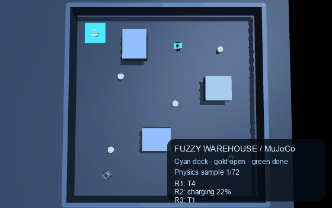

# Fuzzy Robot Coordinator

An explainable fuzzy-logic task allocator connected to a small autonomous warehouse simulation. The **primary demo is MuJoCo**: three motorized differential-drive robots move under MuJoCo physics, choose feasible jobs, and return to a visible charging dock when their battery is low. The browser dashboard is an optional local companion.



Want to see how the math works? Open the [interactive mathematical engine guide](./MATHEMATICAL_ENGINE.md) for rendered equations, expandable worked examples, the fuzzy membership graph, and the MuJoCo animation.

## Run the MuJoCo simulation on macOS

From the repository root, create the environment once if you do not already have one:

```bash
python3 -m venv .venv
source .venv/bin/activate
python -m pip install -r requirements.txt
```

Launch the primary demo with MuJoCo's macOS viewer launcher:

```bash
.venv/bin/mjpython mujoco_sim.py
```

Or double-click `run_mujoco.command` in Finder. It creates the project virtual environment and installs MuJoCo if needed, then opens the same viewer.

The MuJoCo window opens on the warehouse. R2 starts with a low battery and autonomously drives to the cyan charging pad; the other robots begin assigning themselves feasible jobs. Yellow markers are open jobs and green markers are completed jobs. The terminal prints every job's full description and live labels in the 3D view show the robot's current destination or charging state. After the starter jobs are complete, the system queues follow-up delivery runs so the demo keeps moving.

While the viewer is open, enter commands in the same terminal:

```text
task 7 8 3 90 Deliver a medicine kit to the north shelf
status
help
quit
```

Task coordinates are in the 0-10 m warehouse. Payload must be positive and urgency ranges from 0 to 100. The allocator respects robot payload capacity and gives each open task to at most one robot. A robot at or below 25% battery suspends its job, charges to 85%, then returns to the pending work queue. The MuJoCo scene reserves 24 task markers per run; reset the simulation to start a fresh run after reaching that limit.

To verify MuJoCo physics and autonomous movement without opening a window:

```bash
.venv/bin/mjpython mujoco_sim.py --smoke-test 500
```

## Optional browser dashboard

The dashboard is an additional, lightweight visualization and task-entry surface:

```bash
.venv/bin/python simulator.py
```

Open http://localhost:8000. Enter the job description, coordinates, payload, and urgency, or click the warehouse map to select its coordinates before submitting.

See the [web task-entry walkthrough and dashboard screenshot](./MATHEMATICAL_ENGINE.md#add-a-task-in-the-web-dashboard) for step-by-step instructions and how this companion differs from MuJoCo.

This companion server is for local development and has no authentication; do not expose it directly to the public internet.

## Decision engine

The Python prototype computes fuzzy memberships for battery, distance, workload, payload load ratio, and task urgency. Eight Sugeno-style rules produce an interpretable suitability score, and a weighted mathematical baseline provides a comparison. The allocator maximizes total urgency-weighted suitability subject to one-task-per-robot, one-robot-per-task, and payload-capacity constraints. See [MATHEMATICAL_ENGINE.md](./MATHEMATICAL_ENGINE.md) for the membership formulas, rule consequents, objective, constraints, and MuJoCo controller equations.

To rebuild the embedded demo media from the MuJoCo model, install the documentation dependencies and run `.venv/bin/python scripts/render_demo_gif.py`.

## Quantified results

These are measurements from the seeded project scenario and the checks listed below—not real-robot or hardware performance claims.

### Model and allocation

| Measurement | Result |
|---|---:|
| Robots in the seeded warehouse | 3 |
| Initial tasks | 4 |
| Fuzzy inputs | 5: battery, distance, workload, payload-load ratio, urgency |
| Linguistic membership sets | 16 total: 3 + 3 + 3 + 3 + 4 across those inputs |
| Sugeno rule consequents | 8 |
| Combined suitability | 65% fuzzy score + 35% weighted mathematical baseline |
| Candidate pairs in the static 3-robot × 4-task matrix | 12 |
| Capacity-feasible candidate pairs in that matrix | 10 / 12 |
| Task-marker capacity per simulation run | 24 |

For the static planner's seeded inputs, the maximum-total assignment is **T1 → R1** (combined suitability 0.8526), **T2 → R2** (0.5729), and **T4 → R3** (0.7084); T3 is left unassigned. For T1, the combined scores are R1 **0.8526**, R2 **0.6661**, and R3 **0.7573**. Scores are normalized to $[0,1]$; a higher score means a better robot-task match, not a probability of success.

At the MuJoCo scenario's initial dispatch, R2 starts at **22% battery**, below the **25%** charging threshold, and is sent to the dock. R1 receives T4 and R3 receives T1; T2 and T3 wait for an available feasible robot. A robot at the dock charges at **12 percentage points per simulated second** until it reaches **85%**, then rejoins the queue.

### Verification results

| Check | Measured result |
|---|---|
| Automated unit tests | **17 / 17 passed**: 10 fuzzy-engine/planner checks and 7 simulation-state checks |
| Maximum-total matching fixture | Exact match assigns both robots: priority **1.65**, versus **1.00** for the tested greedy choice (**65% higher** total priority) |
| MuJoCo physics smoke test | **500 steps = 5.00 simulated seconds**; **3 / 3** robots had more than 0.05 m net displacement; total tracked path **8.056 m** |
| Per-robot net displacement in that smoke run | R1 **2.752 m**, R2 **2.311 m**, R3 **2.673 m** |
| Jobs during that smoke run | **2 / 4 completed**; **1 / 3** robots charging at the end |
| Browser task-entry check | Submitted one task (3 kg, urgency 90, location 7.2 m × 8.4 m); the dashboard returned **T5** and showed it in the queue |

The automated suite checks membership reference values and score bounds, rejects over-capacity pairs, validates one-to-one assignments and the global matching objective, and exercises task creation, charging, follow-up jobs, and browser-simulation movement. The browser task-entry row above is a separate manual integration check. The MuJoCo smoke test is a short-run movement check, not a statistical benchmark of long-run throughput; task completion and path totals describe one **500-step run**.

Reproduce the automated and physics checks from the repository root:

```bash
.venv/bin/python -m unittest discover -s tests -v
.venv/bin/mjpython mujoco_sim.py --smoke-test 500
```

## Why I built this

This weekend, I wanted to try something new: I used MuJoCo for the first time and applied ideas from my theoretical subjects to a small robotics project. I am exploring how fuzzy logic and mathematical decision-making can help coordinate robots, then using simulation to see those ideas in motion.

## Tests

```bash
.venv/bin/python -m unittest discover -s tests -v
```

The latest recorded run passed all **17** tests. See [Quantified results](#quantified-results) for the test scope, measured allocation example, browser task-entry check, and 500-step MuJoCo smoke-test results.
